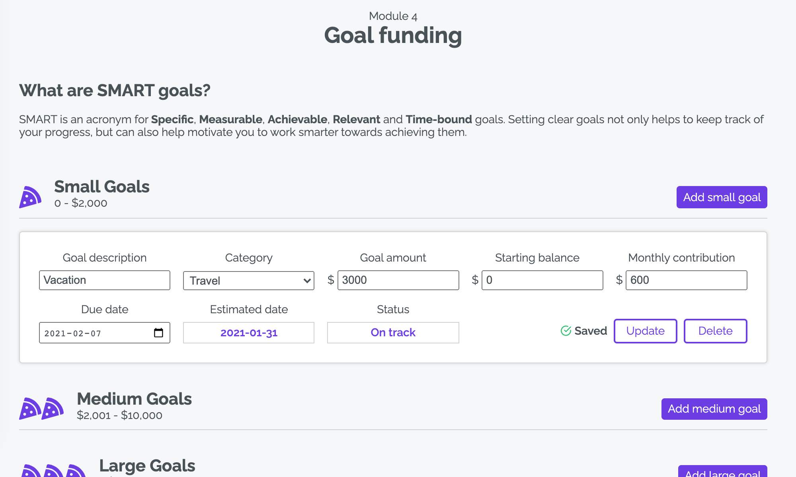

# Wealthvitals - Level up your money

Wealthvitals is a roadmap to level up your money. Find out where you stand and how you can become a wealthier you.

---

## Dashboard

The Wealthvitals dashboard is a quick glance at your financial plan. It feeds data from the results of the various modules that you have completed (more on Modules next).

---

## Modules

Your financial plan consists of 4 key areas: Cash flow, Emergency fund, Debt management and Goal funding. Each module will ask the user to input their information and will produce the calculated results.

| Module 1 - Cash flow                              | Module 2 - Emergency fund                              |
| ------------------------------------------------- | ------------------------------------------------------ |
|  |  |

| Module 3 - Debt management                   | Module 4 - Goal funding                       |
| -------------------------------------------- | --------------------------------------------- |
|  |  |
